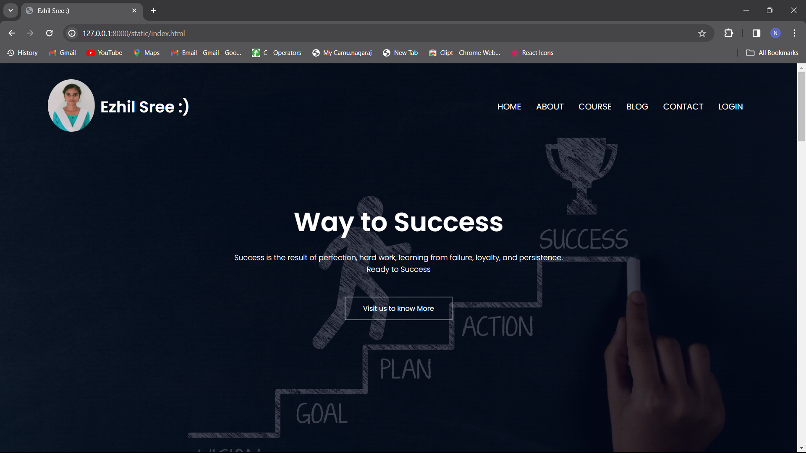
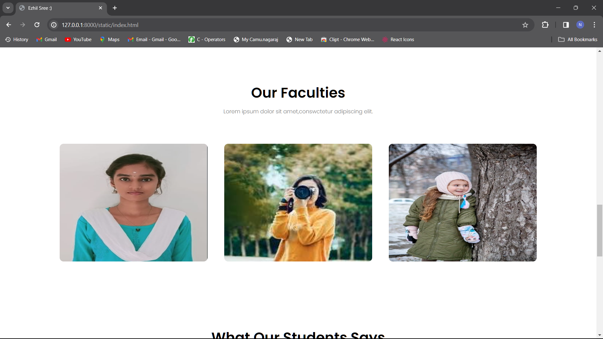
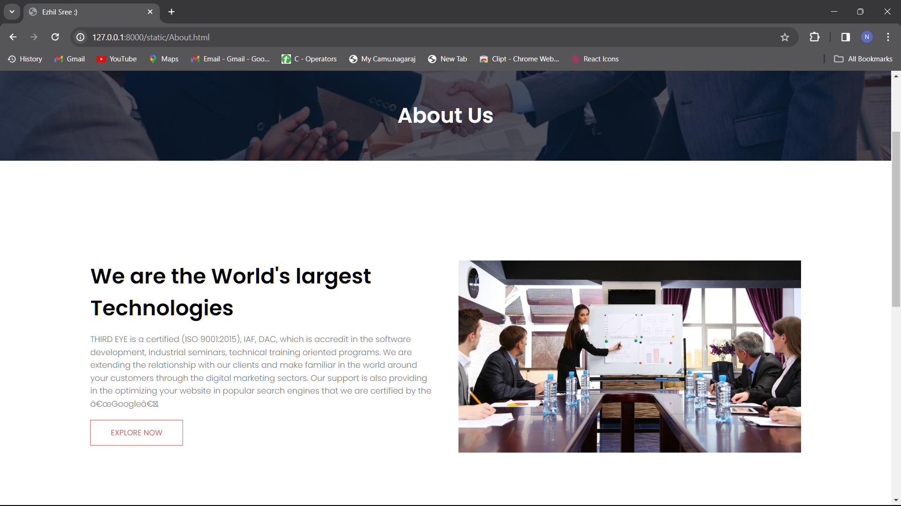
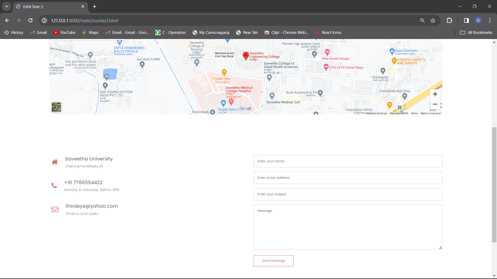
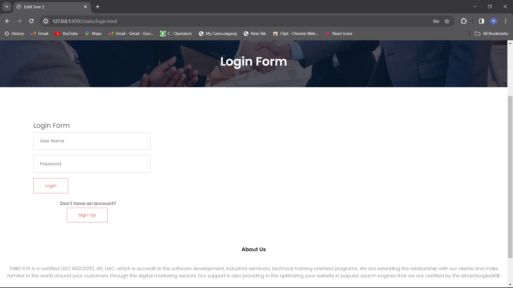
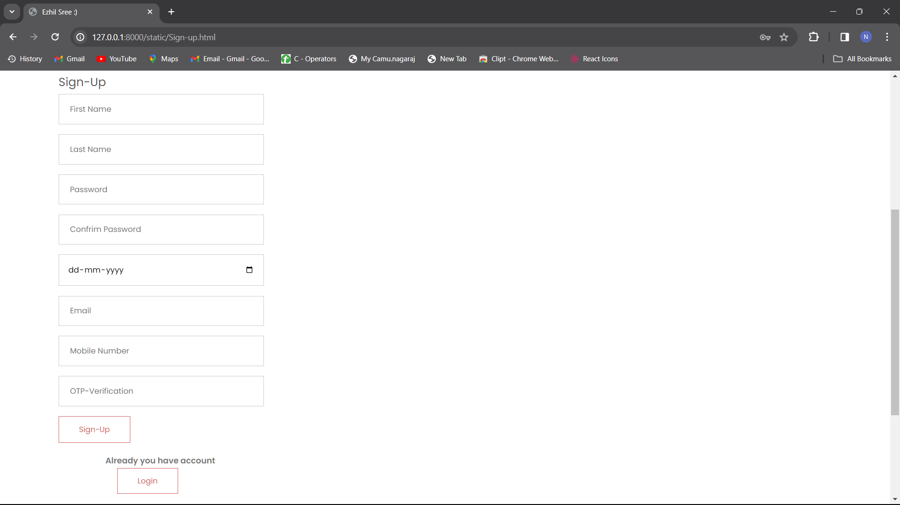

# Ex.07 Software Product Company Website
## Date:15.12.2023

## AIM:
To develop a static company website to display the softwares and services provided by the company.

## DESIGN STEPS:

### Step 1:
Requirement collection.

### Step 2:
Creating the layout using HTML and CSS.

### Step 3:
Updating the sample content.

### Step 4:
Choose the appropriate style and color scheme.

### Step 5:
Validate the layout in various browsers.

### Step 6:
Validate the HTML code.

### Step 7:
Publish the website in the given URL.

## PROGRAM:
```html
<!DOCTYPE html>
<html>
  <head>
    <meta name="view" content="with=device-width, initial-scale=1.0">
    <title>Ezhil Sree :)</title>
    <link rel="stylesheet" href="style.css">
    <link rel="preconnect" href="https://fonts.googleapis.com">
<link rel="preconnect" href="https://fonts.gstatic.com" crossorigin>
<link href="https://fonts.googleapis.com/css2?family=Poppins:wght@100;300;400;600;700&display=swap" rel="stylesheet">

<link rel="stylesheet" href="https://cdn.jsdelivr.net/npm/@fortawesome/fontawesome-free@6.2.1/css/fontawesome.min.css">
<link rel="stylesheet" href="https://cdnjs.cloudflare.com/ajax/libs/font-awesome/4.7.0/css/font-awesome.min.css">
</head>
  <body>
    <section class="header">
      <nav>
        <a href="index.html"> </a>
        <h3 class="com-name">Ezhil Sree :)</h3>
       
        <div class="nav-links" id="navLinks">
          <i class="fa fa-times" onclick="hideMenu()"></i>
          <ul>
            <li><a href="index.html">HOME</a></li>
            <li><a href="About.html">ABOUT</a></li>
            <li><a href="course.html">COURSE</a></li>
            <li><a href="blog.html">BLOG</a></li>
            <li><a href="contact.html">CONTACT</a></li>
            <li><a href="login.html">LOGIN</a></li>
          </ul>
        </div>
        
        <i class="fa fa-bars" aria-hidden="true" onclick="showMenu()"></i>
      </nav>
      
    <div class="text-box">
      <h1>Way to Success</h1>
      <p>Success is the result of perfection, hard work, learning from failure, loyalty, and persistence.<br> Ready to Success
      </p>
      <a href="About.html" class="hero-btn">Visit us to know More</a>
    </div>
    </section>
<!--COURSE-->
<section class="course">
  <h1>Course We Offer</h1>
  <p>Lorem ipsum dolor sit amet,conswctetur adipiscing elit.</p>

  <div class="row">
    <div class="course-col">
      <h3>Internship</h3>
      <p>we are offering internship for college students,who are studying the department of computers.Topics are Web Development,UX/UI animation design,Data Analyst,Cyber Security and other technical course</p>

    </div>
    <div class="course-col">
      <h3>Inplant Training</h3>
      <p>we are offering inplant Training for college students,who are the final year of Engineering Students.Topics are Web Development,UX/UI animation design,Data Analyst,Cyber Security and other technical course</p>
      
    </div>
    <div class="course-col">
      <h3>Technical Course</h3>
      <p>we are offering technical course for students and also for teaching faculties.We are taking all Technical Courses </p>
      
    </div>
  </div>
</section>
<!--CAMPUS-->

<section class="campus">
<h1>Our Global Campus</h1>
<p>Lorem ipsum dolor sit amet,conswctetur adipiscing elit.</p>
<div class="row">
  <div class="campus-col">
    
    <div class="layer">
      <h3>INDIA</h3>
    </div>
  </div>
  <div class="campus-col">
    
    <div class="layer">
      <h3>AMERICA</h3>
    </div>
  </div>
  <div class="campus-col">
    
    <div class="layer">
      <h3>LONDON</h3>
    </div>
  </div>
</div>
</section>

<!--Facilities-->

<section class="facilities">
<h1>Our Faculties</h1>
<p>Lorem ipsum dolor sit amet,conswctetur adipiscing elit.</p>


<div class="row">
  <div class="facilities-col">
    

  </div>
  <div class="facilities-col">
    
 
  </div>
  <div class="facilities-col">
    
  
  </div>
</div>
</section>


<!-------------Testimonials---------->


<section class="testimonials">
<h1>What Our Students Says</h1>
<div class="row">
  <div class="testimonial-col">
    
    <div>
      <p>Around 100% of students get placed in our course.
        The highest salary package offered is 17.5 LPA, 
        the lowest salary package is 4 LPA, 
        and the average salary package is 4.5 LPA. 
        The top recruiting company is Virtusa. 
        Around 95% of students get internships in our course.</p>
      <h3>Frankly</h3>
      <i class="fa fa-star"></i>
      <i class="fa fa-star"></i>
      <i class="fa fa-star"></i>
      <i class="fa fa-star"></i>
      <i class="fa fa-star-o"></i>
    </div>
  </div>
  <div class="testimonial-col">
    
    <div>
      <p> Facilities and infrastructure available for our course are high-speed Wi-Fi. There are different labs like ML lab, VR lab, and robotics lab. Classrooms are the best. Library is great with all kinds of books.</p>
      <h3>Harina</h3>
      <i class="fa fa-star"></i>
      <i class="fa fa-star"></i>
      <i class="fa fa-star"></i>
      <i class="fa fa-star"></i>
      <i class="fa fa-star-half-o"></i>
    </div>
  </div>
</div>
</section>

<!--------Call to action------->

<section class="cta">
  <h1>Enroll for our various online courses <br>Anywhere from the World</h1>
  <a href="contact.html" class="hero-btn">CONTACT US</a>
</section>

<!--------Footer------->

<section class="footer">

  <div class="icons">
    <i class="fa fa-facebook-square"></i>
    <i class="fa fa-twitter"></i>
    <i class="fa fa-instagram"></i>
    <i class="fa fa-linkedin"></i>
  </div>
  <p>Made By <i class="fa fa-heart-o"></i> Ezhil Sree </p>
</section>

<!--JAVASCRIPT for menu-->
    <script>
      var navLinks=document.getElementById("navLinks");
      function showMenu(){
        navLinks.style.right="0"
      }
      function hideMenu(){
        navLinks.style.right="-200px"
      }
    </script>
  </body>
</html>

```
```css
{
  margin: 0;
  padding:0;
  font-family: 'Poppins', sans-serif;
}
.header{
  min-height: 100vh;
  width: 100%;
  
  background-image: linear-gradient(rgb(4,9,30,0.7),rgba(4,9,30,0.7)),url("bg0.jpg");
  background-position: center;
  background-size: cover;

  position: relative;

}

.profile{
  height: 100px;
  width: 100px;
}
.com-name{
  font-size: 30px;
  color: #fff;
 
}

nav{
  display: flex;
  padding:2% 6%;
  justify-content: space-between;
  align-items: center;
}
nav img{
  width: 150px;
}
.nav-links{
  flex: 1;
  text-align: right;
}
.nav-links ul li{
  list-style: none;
  display: inline-block;
  padding: 8px 12px;
  position: relative;
}
.nav-links ul li a{
  color: #fff;
  text-decoration: none;
  font: size 13px;
}
.nav-links ul li::after{
  content: '';
  width: 0%;
  height: 2px;
  background: #d46464;
  display: block;
  margin: auto;
  transition: 0.5s;
}
.nav-links ul li:hover::after{
  width: 100%;
  
}
.text-box{
  width: 90%;
  color: #fff;
  position: absolute;
  top: 50%;
  left:50%;
  transform: translate(-50%,-50%);
  text-align: center;
}
.text-box h1{
  font-size: 50px;
}
.text-box p{
  margin: 10px 0 40px;
  font-size: 14px;
  color: #fff;
}
.hero-btn{
  display: inline;
  text-decoration: none;
  color: #fff;
  border: 1px solid #fff;
  padding: 12px 34px;
  font-size: 13px;
  background: transparent;
  position: relative;
  cursor: pointer;
}
.hero-btn:hover{
border: 1px solid #e3a469;
background: #d46464;
transition: 0.8s;
}

nav .fa{
  display: none;
}
@media(max-width: 700px){
  .text-box h1{
    font-size: 18px;
  }
  .nav-links {
    position: fixed;
    background: #d46464;
    height: 100vh;
    width: 200px;
    top: 0;
    right: -200px;
    text-align: left;
    z-index: 2;
    transition: 1s;
  }
  nav .fa{
    display: block;
    color: #fff;
    margin: 10px;
    font-size: 22px;
    cursor: pointer;
  }
  .nav-links ul{
    padding: 30px;

  }
}

/*----Course-----*/

.course{
  width: 80%;
  margin: auto;
  text-align: center;
  padding-top: 100px;
}
h1{
  font-size: 36px;
  font-weight: 600;
}
p{
  color: #777;
  font-size: 14px;
  font-weight: 300;
  line-height: 22px;
  padding: 10px;
}
.row{
  margin-top: 5%;
  display: flex;
  justify-content: space-between;
}
.course-col{
  flex-basis: 31%;
  background: #d46464;
  border-radius: 10px;
  margin-bottom: 5%;
  padding:20px 12px;
  box-sizing: border-box;
}
h3{
  text-align: center;
  font-weight: 600;
  margin: 10px 0;
}
.course-col:hover{
  box-shadow: 0 0 20px 0px rgba(0, 0, 0, 0.2);
}
@media(max-width: 700px){
  .row{
    flex-direction: column;
  }
}

/*-------CAMPUS-------*/

.campus{
  width:80%;
  margin: auto;
  text-align: center;
  padding-top: 50px;
}
.campus-col{
  flex-basis: 32%;
  border-radius: 10px;
  margin-bottom: 30px;
  position: relative;
  overflow: hidden;
}
.campus-col img{
  width:100%;
  height: 630px;
  display: block;
}
.layer{
  background: transparent;
  height: 100%;
  width: 100%;
  position:absolute;
  top:0;
  left: 0;
  transition: 0.5s;
}
.layer:hover{
  background: #d46464;
}
.layer h3{
  width: 100%;
  font-weight: 500;
  color: #fff;
  font-size: 26px;
  bottom: 0;
  left:50%;
  transform: translateX(-50%);
  position: absolute;
  opacity: 0;
  transition: 0.5s;
}
.layer:hover h3{
  bottom: 49%;
  opacity: 1;
}

/*--------Facilities-------*/

.facilities{
  width: 80%;
  margin: auto;
  text-align: center;
  padding-top: 100px;
}
.facilities-col{
  flex-basis: 31%;
  border-radius: 10px;
  margin-bottom: 5%;
  text-align: left;
  
}
.facilities-col:hover{
  box-shadow: 0 0 20px 0px rgba(0, 0, 0, 0.2);
}
.facilities-col img{
  width: 100%;
  height: 300px;
  border-radius: 10px;
}
.facilities-col p{
  padding: 0;
}
.facilities-col h3{
  margin-top: 16px;
  margin-bottom: 15px;
  text-align: left;
}


/*--------------testimonials---------------*/

.testimonials{
  width:80%;
  margin: auto;
  padding-top: 100px;
  text-align: center;

}
.testimonial-col{
  flex-basis: 44%;
  border-radius: 10px;
  margin-bottom: 5%;
  text-align: left;
  background: #d46464;
 
  cursor: pointer;
  display: flex;
  transition: 0.5s;
}
.testimonial-col:hover{
  box-shadow: 0 0 20px 0px rgba(0, 0, 0, 0.2);
}

.testimonial-col img{
  height: 40px;
  padding-top: 10px;
  margin-left: 5px;
  margin-right: 30px;
  border-radius: 50%;
}
.testimonial-col p{
  padding-top: 10px;
}
.testimonial-col h3{
  margin-top: 15px;
}
.testimonial-col .fa{
  color: aqua;
}
@media(max-width: 700px){
  .testimonial-col img{
    margin-left: 0;
    margin-right: 15px;
 
  }
}

/*---- call to action---*/

.cta{
  margin: 100px auto;
  width: 80%;
  background-image: linear-gradient(rgb(0,0,0,0.7),rgba(0,0,0,0.7)),url("bg1.jpg");
  background-position: center;
  background-size: cover;
  border-radius: 10px;
  text-align: center;
  padding:100px 0;
}
.cta h1{
  color: #fff;
  margin-bottom: 40px;
  padding: 0;
}

@media(max-width:700px){
  .cta h1{
    font-size: 24px;
  }
}


/*-------------------Footer-------------------*/

.footer{
  width: 100%;
  text-align: center;
  padding: 30px 0;
}
.footer h4{
  margin-bottom: 25px;
  margin-top: 20px;
  font-weight: 600;
}
.icons .fa{
  color: #d46464;
  margin: 0 13px;
  cursor: pointer;
  padding: 18px 0;
}
.fa-heart-o{
  color: #d46464;
}

/*----------------about us page-------------*/

.sub-header{
  height: 50vh;
  width: 100%;
  background-image: linear-gradient(rgba(4,9,30,0.7),rgba(4,9,30,0.7)),url("bg2.jfif");
  background-position: center;
  background-size: cover;
  text-align: center;
  color: #fff;
}
.sub-header h1{
  margin-top: 100px;

}
.about-us{
  width:80%;
  margin: auto;
  padding-top: 80px;
  padding-bottom: 50px;
}
.about-col{
  flex-basis: 48%;
  padding:30px 2px
}
.about-col img{
  width: 100%;
}
.about-col h1{
  padding-top: 0;
}
.about-col p{
  padding: 15px 0 25px;
}

.red-btn{
  border: 1px solid #d46464;
  background: transparent;
  color: #d46464;
}
.red-btn:hover{
  color: #fff;
}

/*-----------blog-content--------------*/

.blog-content{
  width: 80%;
  margin: auto;
  padding: 60px 0;
}
.blog-left{
  flex-basis: 65%;
}
.blog-left img{
  width: 100%;
}
.blog-left h2{
  color: #222;
  font-weight: 600;
  margin: 30px 0;
}
.blog-left p{
  color: #999;
  padding:0;
}
.blog-right{
  flex-basis:32% ;
}
.blog-right h3{
  background: #d46464;
  color: #fff;
  padding: 7px 0;
  font-size:16px ;
  margin-bottom: 20px;
}
.blog-right div{
  display: flex;
  align-items: center;
  justify-content: space-between;
  color: #555;
  padding: 8px;
  box-sizing: border-box;
}

.comment-box{
  border: 1px solid #ccc;
  margin: 50px 0;
  padding: 10px 20px;
}
.comment-box h3{
  text-align: left;
}
.comment-form input, .comment-form textarea{
  width: 100%;
  padding: 10px;
  margin: 15px 0;
  box-sizing: border-box;
  border: none;
  outline: none;
  background: #f0f0f0;
}
.comment-form button{
  margin: 10px 0;
}

@media(max-width:700px){
  .sub-header h1{
    font-size: 24px;
  }
}

/*----------- contact us---------------*/


.location{
  width: 80%;
  margin: auto;
  padding: 80px 0;
}
.location iframe{
  width: 100%;
}

.contact-us{
  width:80%;
  margin: auto;
}

.contact-col{
  flex-basis: 48%;
  margin-bottom: 30px;
}
.contact-col div{
  display: flex;
  align-items: center;
  margin-bottom: 40px;
}
.contact-col div .fa{
  font-size: 28px;
  color: #d46464;
  margin: 10px;
  margin-right: 30px;
}
.contact-col div p{
  padding: 0;
}
.contact-col div h5{
  font-size: 20px;
  margin-bottom: 5px;
  color: #555;
  font-weight: 400;
}
.contact-col input, .contact-col textarea{
  width: 100%;
  padding: 15px;
  margin-bottom: 17px;
  outline: none;
  border: 1px solid #ccc;
  box-sizing: border-box;
}


.login-col{
  margin-top: 100px;
  width: 350px;
  margin-left: 100px;
 
  flex-basis: 48%;
  margin-bottom: 30px;
}
.login-col  h5{
  font-size: 20px;
  margin-bottom: 5px;
  color: #555;
  font-weight: 400;
}
.login-col input, .contact-col textarea{
  width: 100%;
  padding: 15px;
  margin-bottom: 17px;
  outline: none;
  border: 1px solid #ccc;
  box-sizing: border-box;
}

.login1{
  margin-top: 10px;
  margin-left: 70px;
}
.login1 p{
  font-weight: 600;
}
.login2{
  margin-left: 30px;
}
.profile{
  border-radius: 50%;
  width: 90px;
  /* height: 90px; */
  margin-right: 10px;
}
```

## OUTPUT:







## RESULT:
The program for designing software company website using HTML and CSS is completed successfully.
